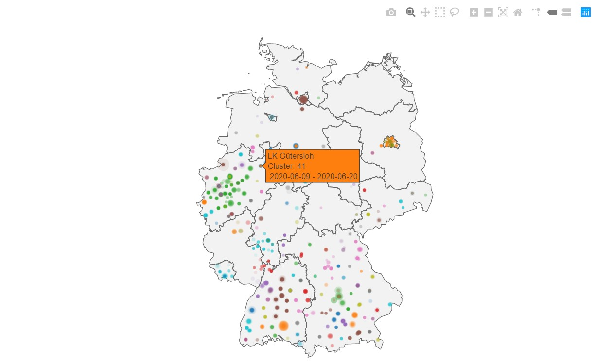

# Spatiotemporal Clustering of COVID-19 Infections in Germany

Jupyter lab project for spatiotemporal cluster analysis of COVID-19 cases published by the Robert-Koch Institute.

(c) 2020 David Frantz

Demonstration lesson for `Geoinformatics - Spatial Data Science`, Trier University

